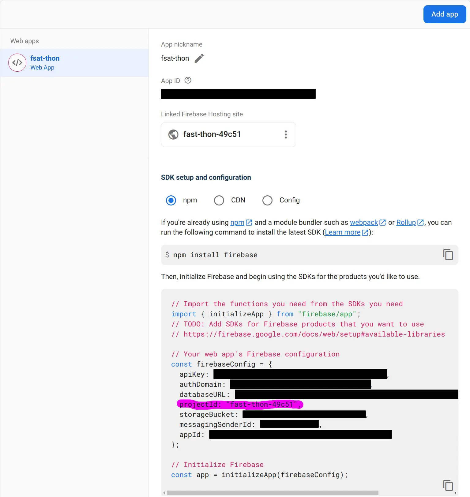
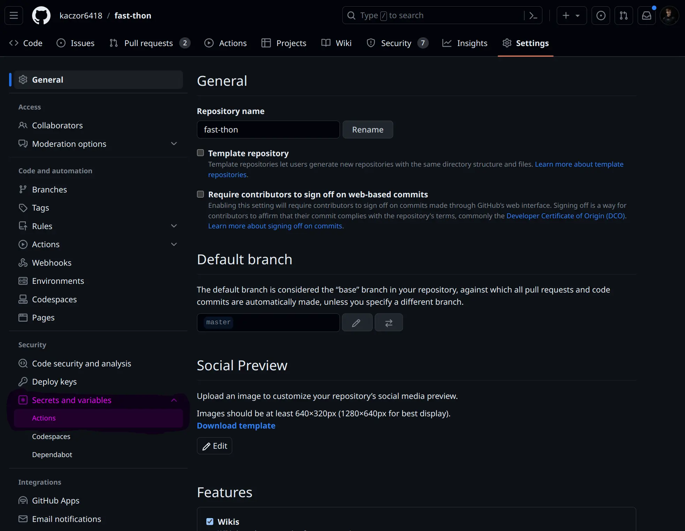

# fast-thon

1. [Description](#description)
2. [Philosophy](#philosophy)
3. [What's inside](#whats-inside)
4. [Requirements](#requirements)
5. [Downloading the repository](#downloading-the-repository)
6. [Using the repository](#using-the-repository)
   - [Connecting with Firebase project](#connecting-with-firebase-project)
   - [Setting-up CI/CD](#setting-up-cicd)
   - [Running project](#running-project)
   - [Documentation](#documentation)
   - [Scripts](#scripts)

## Description

This repository contains a boilerplate to start building an app prototype and focuses on implementation of business
logic of the idea for your app. All configuration like **DB connection**, **CDN storage**, **authentication**, **build
pipeline**, **deployment**, **static code analysis** is ready to use, so you do not have to spend time on configuration
of your project.

## Philosophy

When I was attending hackathons, I always lose time to set up my whole environment before I actually started
implementing my idea. I have decided that I want to have a boilerplate that will have a preconfigured connection with
DB, CDN storage, Authentication, build pipeline… . In the future, it is possible I will extend this boilerplate with
features that I will be missing during hackathons.

## What's inside

- Configured connection with **_[Firestore](https://firebase.google.com/docs/firestore)_**
- Configured connection with **_[Cloud Storage for Firebase](https://firebase.google.com/docs/storage)_**
- Functions for authentication **_[Firebase Authentication](https://firebase.google.com/docs/auth)_**
- Improved types for firestore
- Configured **Firestore**, **Firebase Storage** and **Firebase Authentication** emulators
- Configured deploy pipeline
- Configured CI/CD pipeline
- Configured TanStack Router
- Full PWA support
- Theme toggle
- Configured **_[i18n](https://www.i18next.com/)_**
- Configured **_[MUI](https://mui.com/)_** with prepared files inside **_`./src/mui`_** open for your changes in theme,
  typography...
- Configured **_[Eslint]()_** and **_[Prettier]()_** with a set of rules that you can adjust to your needs

## Requirements

Before you will use this repository make sure that you have installed:

- **_Git_**
  - If you are a **Windows** or **macOS** user, visit this link **[Downloading Git](https://git-scm.com/download/win)**
    then download the appropriate installer and install it.
  - If you are a **Linux** (Arch-based distribution) user, you can paste bellow scrip into your terminal or visit this
    page **[Installing Git](https://git-scm.com/book/en/v2/Getting-Started-Installing-Git)**

    ```bash
    pacman -S git
    ```

- **_Node.js_** and **_npm_**
  - If you are a **Windows** or **macOS** user, visit this link **[Node.js download](https://nodejs.org/en/download/)**
    then download _LTS_ version for Windows and install it.
  - If you are a **Linux** (Arch-based distribution) user, you can paste bellow scrip into your terminal or visit this
    page **[Node installation instruction](https://aur.archlinux.org/packages/nvm)** or use
    **[nvm](https://github.com/nvm-sh/nvm#install--update-script)**

    ```bash
    paru -S nvm
    nvm install node
    nvm use node
    ```

- **_Java 11+_**
  - If you are a **Windows** or **macOS** user, visit this link
    **[OpenJDK Installation ](https://openjdk.org/install/)** and follow instructions.
  - If you are a **Linux** (Arch-based distribution) user, you can follow these instructions
    **[OpenJDK Installation](https://openjdk.org/install/)** or use this command:

    ```bash
    pacman -S jdk-openjdk
    ```

If you followed every step, you should be ready to start using this repository. To make sure that you have installed
everything correctly open your terminal git-bash and run the following commands:

- To check **git**: _`git --version`_ → you should see output with **git** version
- To check **node.js**: _`node --version`_ → you should see output with **node.js** version
- To check **npm**: _`npm --version`_ → you should see output with **npm** version
- To check **java**: _`javac --version`_ → you should see output with **javac** version

## Downloading the repository

- Create a fork of this project on your GitHub account
- Open your terminal / git-bash in a location where you want to create a directory which will contain this repository
- Run the following command in your terminal / git-bash

  ```bash
  git clone git@github.com:kaczor6418/fast-thon.git
  cd ./fast-thon
  ```

## Using the repository

### Connecting with Firebase project

Once you downloaded the repository, you need to set and synchronize your Firebase project name with this repository.
Otherwise, deploying firestore rules, storage rules, page deployment and CI/CD pipeline can end with errors. You can
find the project ID in **_Project settings_** tab.



Then you need to run the below command with the project-id that you have found.

```
npm run firebase:link-app fast-thon-49c51
```

### Setting-up CI/CD

To make GitHub actions work you need to generate your personal Firebase API token and attach it as a secret inside you
repository.

**What you need to do:**

1. Open Firebase [console](https://console.firebase.google.com/) in your web-browser
2. Navigate to your **_Project setting_** 
3. Navigate to **_Service accounts_** 
4. If you do not have **_Service account_** yet, you should see a button to **_Create service account_**
5. In Firebase Admin SDK find **_Generate new private key_** button and click it
   
6. Firebase Admin SDK Key should be generated and download to your disk in `.json` format
7. Now open GitHub with fork/copy of **fast-thon** repository
8. Open **_Setting_** tab 
9. Find **_Secrets and variables_** section in left navbar and choose **_Actions_**
   
10. Find **_New repository secret_** button and click it 
11. As **_Name_** of your secret put **_`FIREBASE_SERVICE_ACCOUNT_TOKEN`_**
12. Inside **_Secret_** area put content of Firebase Admin SDK `.json` file you have generated
13. Click **_Add secret_** button
14. Now you should be redirected to the list of your secrets, and you should see new secret in the list
    
15. Now GitHub actions should work

### Running project

To run this project locally, make sure you are in root directory of **fast-thon** repository, and you have installed all
dependencies:

```
npm i
```

Then you need to start Firebase emulators first:

```
npm run firebase:start:emulators
```

> Emulator UI should be available under **_[http://127.0.0.1:4000/](http://127.0.0.1:4000/)_**

Then in a separated terminal you need to run the application:

```
npm run start
```

> App preview should be available under **_[http://localhost:5173/](http://localhost:5173/)_**

### Documentation

To check documentation, please visit **_[wiki page](https://github.com/kaczor6418/fast-thon/wiki/fast-thon)_**

### Scripts

- To start a local web server with HMR for development
  ```
  npm run start
  ```
- To create a production build
  ```
  npm run build
  ```
  > If you have errors in the terminal about not enough privileges to create some files/dirs use this command with
  > `sudo` or add the necessary privileges to your **_node_modules_**
- To start a local web server that serves the built solution
  ```
  npm run preview
  ```
- To start an eslint static code analysis report
  ```
  npm run lint
  ```
- To start eslint static doe analysis and fix all auto-fixable errors
  ```
  npm run lint:fix
  ```
- To start a code formatter analysis report
  ```
  npm run prettyprint
  ```
- To start code formatter analysis and fix all auto-fixable errors
  ```
  npm run prettyprint:fix
  ```
- To integrate a CI/CD pipeline with a firebase project
  ```
  npm run firebase:link-app [project-name]
  ```
- To log in to your firebase account
  ```
  npm run firebase:login
  ```
- To start Authentication, Firestore and Storage emulators
  ```
  npm run firebase:start:emulators
  ```
- To deploy all Firestore security rules, storage security rules and Firestore indexes
  ```
  npm run firebase:deploy
  ```
- To deploy all storage security
  ```
  npm run firebase:deploy:storage-rules
  ```
- To deploy all Firestore security rules
  ```
  npm run firebase:deploy:firestore-rules
  ```
- To deploy all Firestore indexes
  ```
  npm run firebase:deploy:firesotre-indexes
  ```
- To stop tracking changes in db-seed
  ```
  npm run git:stop-tracking-db-seed
  ```
  > This can be useful if you pushed some changes to db-seed, and you want to keep seed ignored
- To run integration tests
  ```
  npm run test:integration
  ```
  > Remember to run `npm run firebase:start:emulators` before starting integration tests
- To run integration tests and watch for changes
  ```
  npm run test:integration:watch
  ```
  > Remember to run `npm run firebase:start:emulators` before starting integration tests
- To run integration tests inside CI env
  ```
  npm run ci:test:integration
  ```
